<p align="center">
  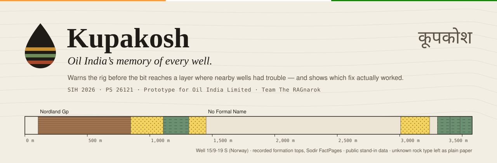
</p>

<p align="center">
  
  
  
  
  
  
</p>

<p align="center">
  <b>Others search your PDFs. Kupakosh <i>remembers</i>.</b><br>
  <sub>Team <b>The RAGnarok</b> · Lead: Jay Naik · Prototype for Oil India Limited · Smart India Hackathon 2026</sub>
</p>

---

> [!IMPORTANT]
> **Decision support only — the engineer decides.**
> Every well in this prototype comes from **public** records in Norway, the UK, the Netherlands, the USA, Australia, New Zealand and Canada, plus public Indian sources (NDR/DGH, OISD, audits, court records). They stand in for Oil India's own reports. **No Oil India well data is used or claimed.** Every number below comes from the live database or a measured evaluation; the caveats are in [`docs/LIMITATIONS.md`](docs/LIMITATIONS.md).

## The problem

Oil India drills wells 2–4 km deep, through underground rock layers called **formations**. The same problems keep coming back in the same layers across nearby wells:

**mud losses · kicks · stuck pipe · torque spikes · overpressure · cementing failures · fishing.**

What happened in the older nearby wells (**offset wells**) is written down, but it is buried in thousands of daily drilling reports and completion reports. The live rig system (eRTMAC) shows the well being drilled *now*, with no memory of the wells drilled before it.

## The idea

Most tools *search* the raw PDFs every time a question is asked. Kupakosh **compiles** them once, into two things an engineer can trust:

1. **A Well Wiki**: Markdown pages per well, formation and hazard, with a citation on every sentence. An engineer approves each page, and every change is kept in git history.
2. **A problem → action → outcome ledger**, which shows *which fix actually worked* and how often, with the number of cases behind it.

On top of these sit an honest hazard model, a look-ahead alert that warns before the bit reaches a risky layer, and a blind test that measures whether those warnings would have come in time.

## What makes it different

| Feature | In one line |
|---|---|
| **Well Wiki** | Cited on every sentence, approved through government-file-style noting (Approve / Edit / Return, each a numbered note and a git commit), versioned in git. Uncited sentences and unsupported numbers are rejected by the compiler. |
| **"What actually worked" ledger** | Each fix is ranked by its success rate *and* the lower bound of that rate (Wilson). Cases, median time to resolve, and **"made worse"** counts are shown. Fewer than 3 cases is tagged *anecdotal*. |
| **Hindsight test** | The model is replayed blind on real history: for each well, it only sees *other* wells, then we check whether it flagged the layer where trouble really happened. |
| **Honest hazard model** | Probability with an 80 % range and the evidence count behind it. When the evidence is thin, it says **"insufficient evidence"** instead of guessing. |
| **Mud-weight window + casing lessons** | Safe mud-weight range per formation from real leak-off tests (LOT/FIT), kicks and losses, each point linked to its source. |
| **Report checker** | Cross-checks reports against tables, other reports and rig sensors, and flags where they disagree. |
| **Upper Assam column** | Oil India's own formations, Dhekiajuli down to Disang. Rock type, age and role (reservoir, source rock, cap rock) are all quoted from public DGH/NDR sentences with a citation on each fact. Beside each one: measured problem rates in the same rock type abroad, with range and evidence count, and what worked there. |
| **India Analogs** | For 23 Indian sedimentary basins (NDR/DGH), finds wells abroad drilled through similar rock at similar depths, and shows what went wrong there. |

## Screens

<table>
<tr>
<td width="50%">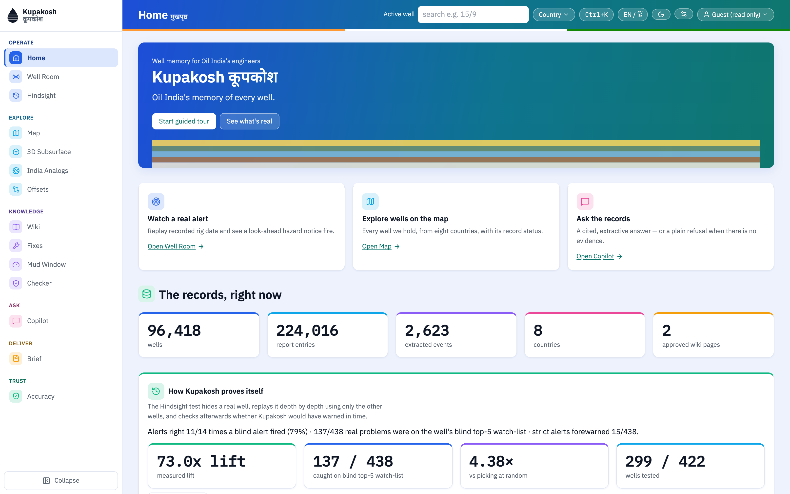<br><b>Home</b> — the real formation column of a well as the banner, the proof numbers, and the way in.</td>
<td width="50%">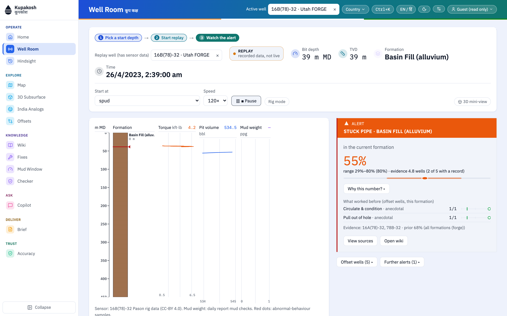<br><b>Well Room</b> — a <code>REPLAY</code> of real rig-sensor data. About 150 m before a risky layer, the alert shows the hazard, its probability and range, and what worked before.</td>
</tr>
<tr>
<td>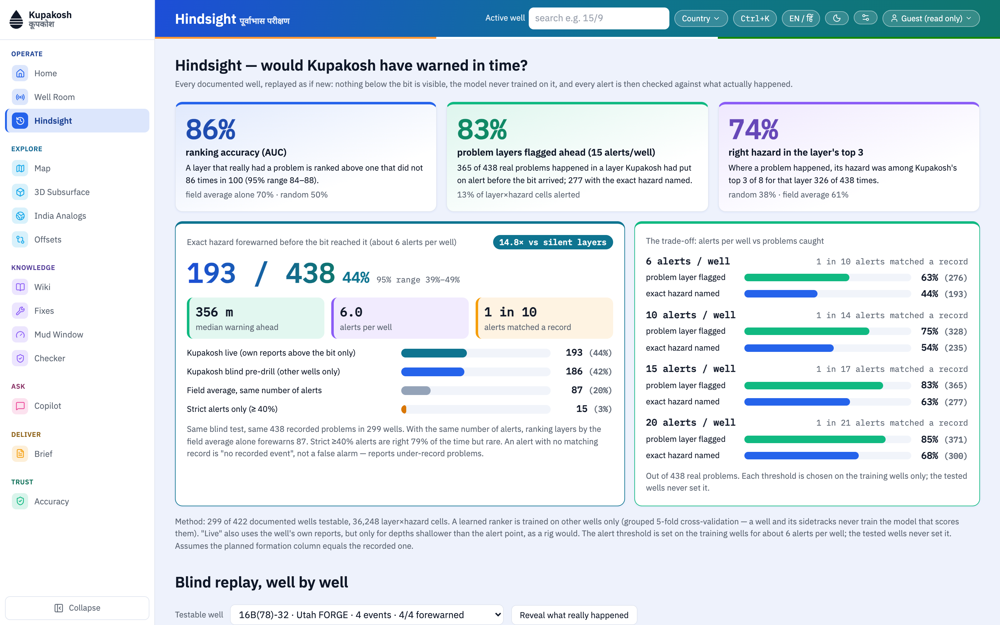<br><b>Hindsight</b> — the blind test on 449 real problems, with its trade-off curve.</td>
<td>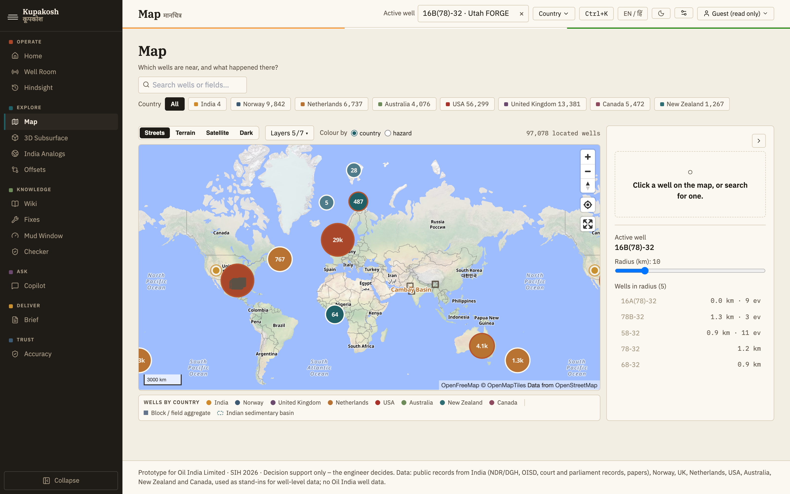<br><b>Map</b> — every located well in 8 countries, Indian basins, radius search; Streets, Terrain (3D), Satellite and Dark base maps.</td>
</tr>
<tr>
<td>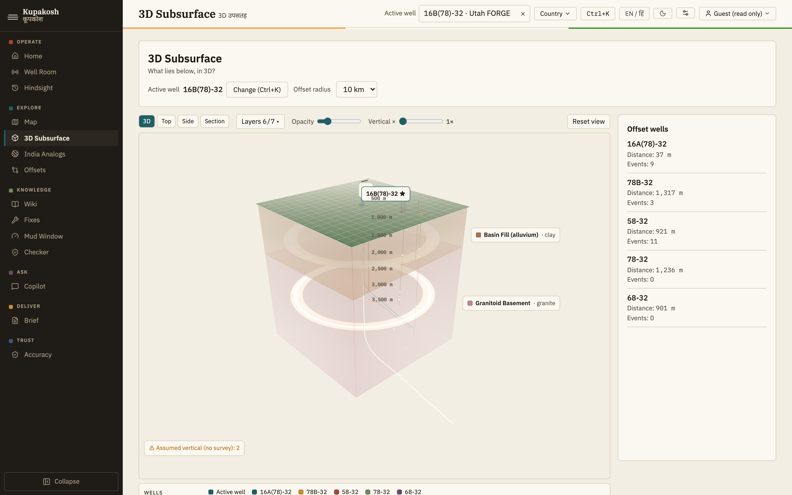<br><b>3D Subsurface</b> — the active well, its offsets, the formation block and the layers where problems were recorded.</td>
<td>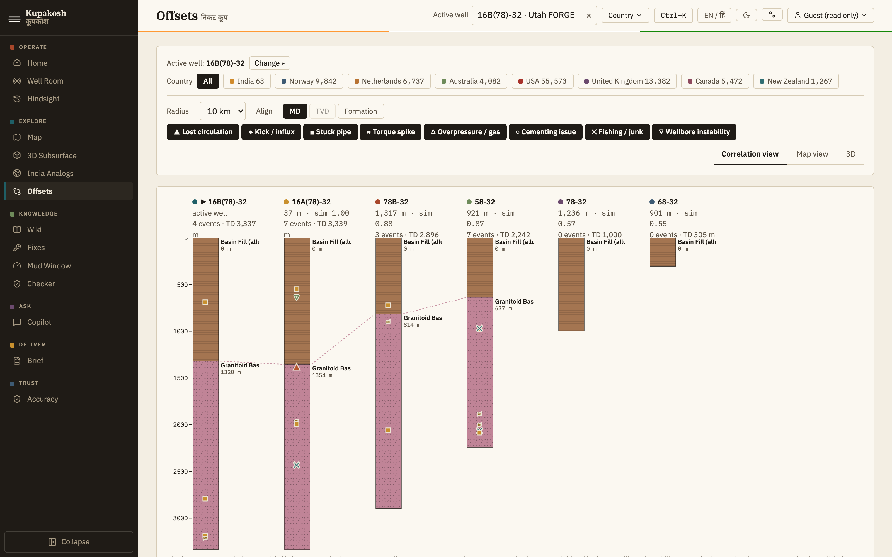<br><b>Offsets</b> — nearby wells side by side, aligned by depth or formation, with every recorded event.</td>
</tr>
<tr>
<td>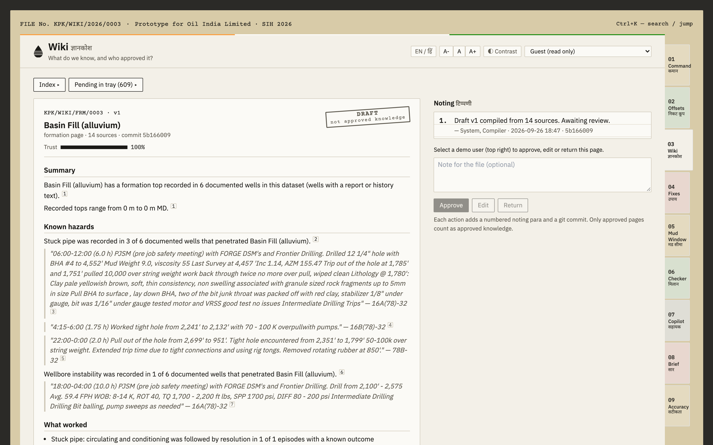<br><b>Wiki</b> — cited pages with a noting sheet, approval stamp and version diff.</td>
<td>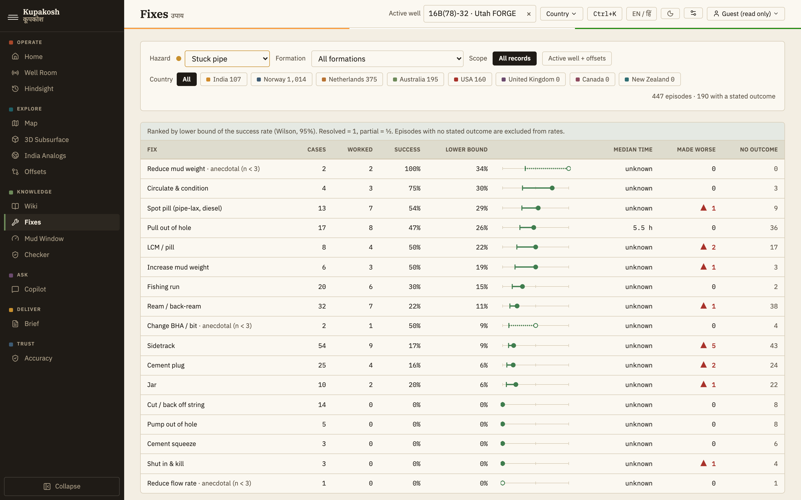<br><b>Fixes</b> — the ledger: what worked, how often, and what made things worse.</td>
</tr>
<tr>
<td>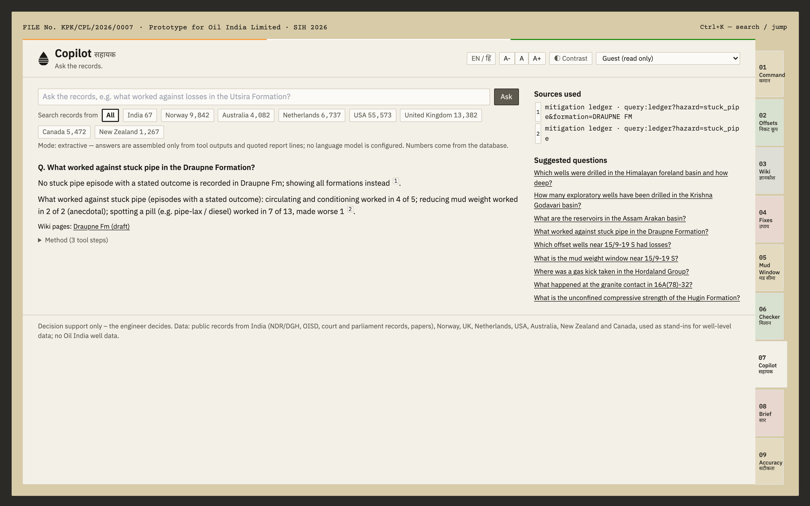<br><b>Copilot</b> — answers only from the records, with sources; otherwise it says "No evidence found in the records."</td>
<td>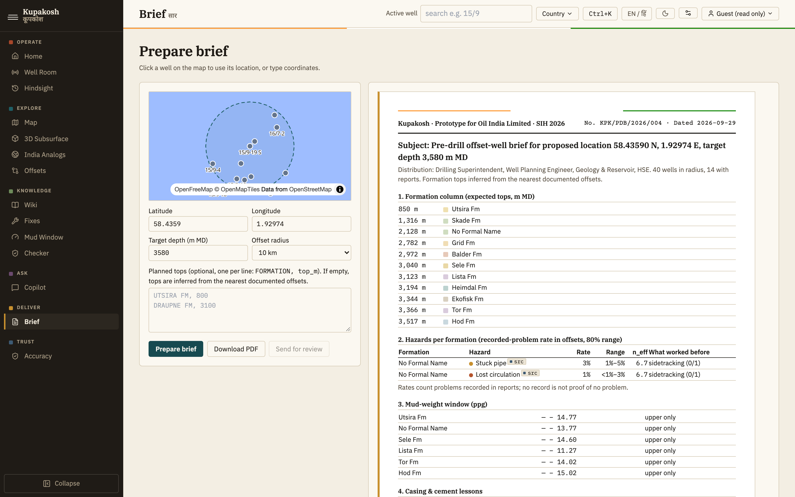<br><b>Brief</b> — a pre-drill brief as an official-style A4 document, downloadable as a PDF.</td>
</tr>
<tr>
<td>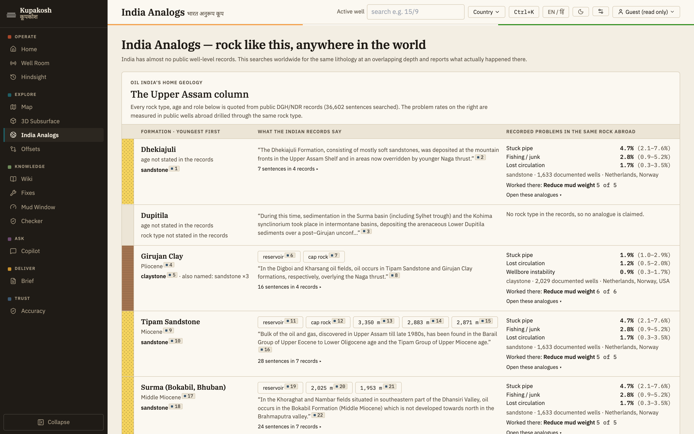<br><b>India Analogs</b> — the Upper Assam column from cited DGH/NDR records, and similar rock abroad for each Indian basin, with the source of every match.</td>
<td>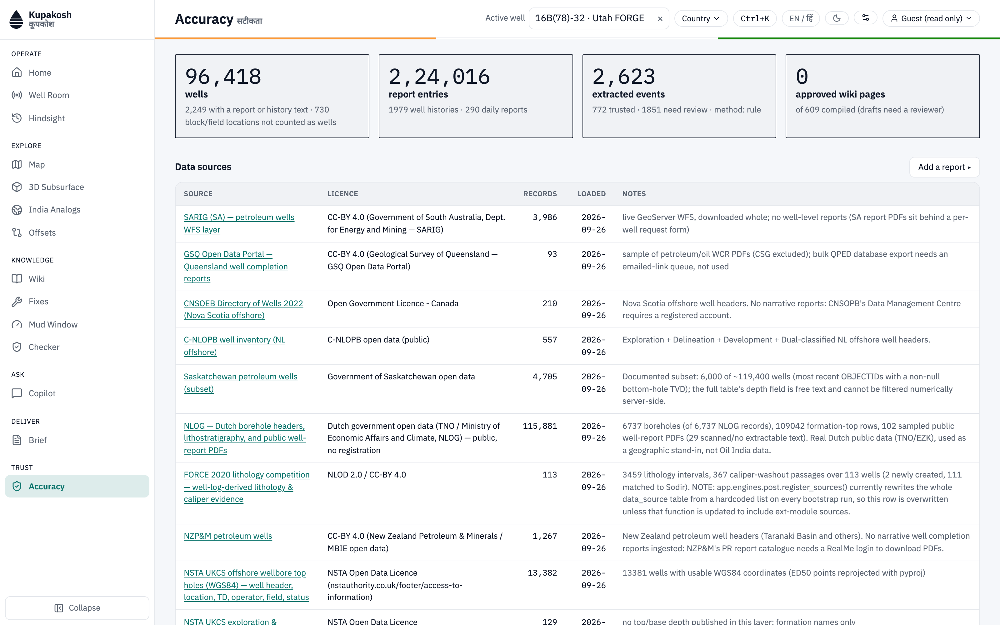<br><b>Accuracy</b> — the honesty page: counts, data sources, measured accuracy and known limits.</td>
</tr>
</table>

Also: **Mud Window**, **Checker**, a **Ctrl+K** command palette, an **EN / हिं** language switch, text-size and high-contrast controls, and dark mode.

## The proof: the Hindsight test

We replayed **304 public wells** (Norway and the USA) layer by layer. For every well, the model was trained on *other* wells only (grouped 5-fold cross-validation by well family). In live mode it may read the well's own reports only from above the alert point. Then we checked it against **449 real recorded problems** across **36,776 layer cells**.

| Measure | Kupakosh | Comparison | What it means |
|---|:-:|:-:|---|
| **Ranking accuracy (AUC)** | **0.86** <sub>(95 % CI 0.842–0.876)</sub> | field average 0.69 | Picks a real problem layer over a quiet one 86 times in 100. |
| **Problem layer flagged before the bit arrived** | **79.5 %** | — | At 15 alerts per well. The trade-off: 61.7 % at 6 · 70.2 % at 10 · 84.2 % at 20. |
| **Right hazard in the layer's top 3** | **74.4 %** | random 37.5 % | When trouble came, the true hazard was among the three named. |
| **Exact hazard forewarned** | **193 / 449** | field average 86 / 449 | At about 6 alerts per well, a median **348 m** before the bit got there. |

> [!NOTE]
> These are not "alerts that were right". Most alerts do not match a recorded event (about 1 in 10 does), partly because reports under-record problems. The thresholds are chosen on training wells only. The tested well and its sidetracks are excluded from their own prior. Full detail: [`docs/LIMITATIONS.md`](docs/LIMITATIONS.md) item 15.

## Measured accuracy

| Evaluation | Result | n | How it was measured |
|---|:-:|:-:|---|
| Event extraction — precision | **0.92** | 36 | Hand-labelled report lines (AI-labelled, pending human check) |
| Event extraction — recall | **0.87** | 38 | same set |
| Depth within ±30 m | **0.92** | 13 | same set |
| Episode outcome — precision | **0.78** | 18 | 30 sampled problem → action → outcome episodes |
| Copilot — cites the right source | **1.00** | 25 | templated questions (optimistic, see limits) |
| Copilot — refuses when it should | **1.00** | 30 | includes questions with no answer in the records |
| Hazard model — Brier score (leave-one-well-out) | 0.0035 | 41,848 | **equal to the base rate: no measured skill on its own**, which is why the UI shows ranges and says "insufficient evidence" |

## What's inside

| | |
|---|---:|
| Wells (8 countries) | **96,418** |
| Report sentences, each traceable to its page and line | **2,24,016** |
| Formation tops | **1,54,058** |
| Recorded drilling problems (events) | **1,851** |
| Problem → action → outcome episodes | **1,851** |
| Leak-off / formation-integrity tests | **3,752** |
| Casing strings | **9,133** |
| Mud checks | **35,975** |
| Real rig-sensor samples (replay) | **3,50,172** |
| Wiki pages approved | **951** |

<details>
<summary><b>By country</b></summary>

| Country | Wells | Reports linked | Problems recorded |
|---|--:|--:|--:|
| Norway (Sodir, FORCE 2020) | 9,842 | 2,026 | 1,014 |
| Netherlands (NLOG) | 6,737 | 99 | 375 |
| Australia (SARIG, GSQ) | 4,082 | 85 | 195 |
| USA (Utah FORGE, BSEE) | 55,573 | 297 | 160 |
| India (NDR/DGH, OISD, audits, courts) | 63 | 17 | 107 |
| United Kingdom (NSTA) | 13,382 | 80 | 0 |
| Canada (CNSOPB, C-NLOPB, Saskatchewan) | 5,472 | 0 | 0 |
| New Zealand (NZP&M) | 1,267 | 0 | 0 |

UK, Canada and New Zealand are well headers only: their report archives need a login.
</details>

## How it works

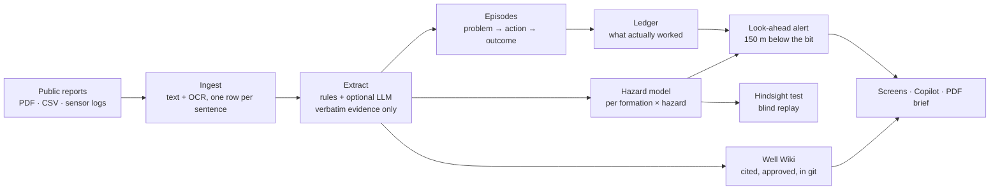

Every fact keeps a `source_ref` — a report sentence (`doc:<id>#<page/para/sentence>`), an official table row, or a sensor record — and `GET /api/source?ref=` opens the original text. More in [`docs/ARCHITECTURE.md`](docs/ARCHITECTURE.md).

## Run it

Tested on macOS; no Docker needed.

```bash
make setup      # Python 3.11 venv (uv) + npm install;  brew install pango  for PDF output
make data-core  # Norway + Utah FORGE + India: enough for a working demo
make bootstrap  # builds data/kupakosh.db, the wiki (git) and runs the evaluations
make api        # backend  → http://localhost:8010
make demo       # website  → http://localhost:3001  (fast production build)
```

For development use `make web` (http://localhost:3000, hot reload). Tests: `make test` (backend + type-check + unit tests) and `make e2e` (Playwright: every screen loads with no console errors, at most 3 zones, WCAG AA contrast, Hindi toggle).

The LLM passes are optional: set `GEMINI_API_KEY` or `GROQ_API_KEY` in `.env` to switch them on. Without a key, extraction runs on rules and the copilot stays extractive.

### A 5-minute demo

1. **Accuracy** — real public data: 96,418 wells, 2,24,016 report sentences, measured accuracy with its n.
2. **Well Room** — start the replay; about 150 m before a risky layer the alert appears with probability, range and evidence count.
3. **View source** — the exact report line opens.
4. **Wiki** — the formation page: citations, approval stamp, noting sheet, version diff.
5. **Fixes** — a fix that *made things worse*.
6. **Hindsight** — the blind test and its trade-off.
7. **Copilot** — one cited answer, one correct refusal.
8. **Brief** — download the pre-drill PDF.
9. **Close** — Oil India can load its own daily reports, completion reports and eRTMAC streams without changing the schema.

## Built with

| Layer | Choice |
|---|---|
| Backend | Python 3.11 · FastAPI · Pydantic v2 · SQLAlchemy 2 · SQLite (WAL) |
| Search | `BAAI/bge-small-en-v1.5` embeddings (local) + BM25, fused |
| Models | scikit-learn gradient-boosted ranker · Beta–Binomial hazard model · Wilson intervals |
| Documents | pdfplumber · Tesseract OCR (confidence kept per page) · WeasyPrint PDF · GitPython wiki |
| Frontend | Next.js 14 · TypeScript · Tailwind · MapLibre GL (OpenFreeMap, Esri imagery, AWS terrain) · three.js / react-three-fiber |
| Type | IBM Plex Serif / Sans / Mono · Noto Sans Devanagari |

The PostgreSQL + PostGIS + pgvector stack in `docker-compose.yml` is the intended deployment target but has **not** been verified on the build machine.

## Project layout

```
backend/    FastAPI app — ingest/, extract/, engines/, wiki/, copilot/, brief/, eval/, api/
frontend/   Next.js app — 14 screens, components/kk design system, e2e tests
config/     default.yaml (every threshold and weight) · taxonomy.yaml (hazards, actions, outcomes)
wiki/       the compiled Well Wiki, its own git repository
docs/       architecture, limitations, data report, deck guide, screenshots
data/       raw downloads and the built database (gitignored)
```

## Honest limits

- **Stand-in data.** Public records from other countries, not Oil India's. Reports under-record problems, so rates are rates of *recorded* problems.
- **The hazard model alone has no measured skill** (its Brier score equals the base rate's). The learned ranker in the Hindsight test is what adds the lift.
- **Gold labels, 1,079 event reviews and the wiki approvals were made by an AI pass**, at the project lead's request, and are marked `ai_review`. They still need an engineer's check before any external claim.
- **The live feed is a replay** of recorded Utah FORGE sensor data, labelled `REPLAY`. There is no eRTMAC/WITSML adapter yet.
- **All 951 wiki pages were approved by an AI review**, marked "AI review, authorised by Jay Naik", after a check that every sentence is cited. An engineer should re-approve them before use. The names R. Das and A. Sharma are demo placeholders.

The full list, with numbers: [`docs/LIMITATIONS.md`](docs/LIMITATIONS.md).

## Getting the data

`data/raw/` is gitignored, so a fresh clone downloads it again. Everything is public and needs no login. Both entry points are safe to re-run; files already present are skipped.

```bash
make data-core   # fast path: Norway (Sodir) + Utah FORGE (USA) + India
make data        # everything: also UK, Netherlands, Australia, USA (BSEE), New Zealand, Canada
```

<details>
<summary><b>Sources, licences and sizes</b></summary>

| Source | Country | Licence | Approx. size |
|---|---|---|---|
| Sodir FactPages (wellbore, tops, casing, mud, history CSVs) | Norway | NLOD 2.0 | ~25 MB |
| Utah FORGE (DDR PDFs, Pason/mud-log data, surveys, 6 wells) | USA | CC-BY | ~1 GB |
| FORCE 2020 lithology competition | Norway (Sodir data) | NLOD 2.0 | ~140 MB |
| NDR/DGH, OISD alerts, Oil India/ONGC annual reports, CAG audits, NGT/court orders, press | India | Mixed public/government | ~250 MB |
| NSTA Open Data (3 ArcGIS layers + sampled legacy report PDFs) | UK | NSTA Open Data Licence | ~140 MB |
| NLOG (borehole headers/details, stratigraphy CSV, sampled well reports) | Netherlands | Dutch government open data | ~350 MB |
| SARIG (South Australia) + GSQ (Queensland WCR PDF sample) | Australia | CC-BY 4.0 | ~250 MB |
| BSEE borehole file, incident-narrative PDFs, yearly workbooks | USA (Gulf OCS) | US public domain | ~180 MB |
| NZP&M "Petroleum Wells" ArcGIS layer | New Zealand | CC-BY 4.0 | <5 MB |
| CNSOPB, C-NLOPB, Saskatchewan ArcGIS layers | Canada | Open Government Licence / public | ~10 MB |

Both targets run `backend/scripts/download_world.sh`. It also takes explicit sections (`bash backend/scripts/download_world.sh uk nz canada`) and another destination (`DATA_DIR=/some/path bash backend/scripts/download_world.sh ...`). It re-pages the ArcGIS layers and re-issues the NLOG bulk calls, so record counts match what is already on disk, and it ends with a summary of what is present and what is missing.
</details>

<details>
<summary><b>What can't be scripted</b></summary>

- **`data/raw/australia/gsq/wcr_meta.json`** is built from several filtered GSQ CKAN searches, not one stable URL. The PDFs it lists are re-fetched, but the portal's firewall rate-limits, so a run may miss a few of the ~90 PDFs; re-run to pick them up.
- **South Australian well-completion reports** (SARIG / PEPS-SA): every scripted or headless request gets a 403. Never obtained.
- **`data/raw/netherlands/nlog/{docs_index_sample,selected_reports}.json`** is a one-off editorial sample (about 280 of 6,737 wells inspected, 117 PDFs picked). The PDFs themselves re-download fine.
- **New Zealand and Canadian report text** needs a login (RealMe / a requested account), so only well headers are scripted.
- **`data/raw/force2020/lithology_key.csv`** was transcribed by hand from the competition README.
- India's `eparlib.sansad.in` committee report and DGH activity reports after 2014-15 were not reachable at the expected URLs when last checked (see `data/raw/india_more/REPORT.md`).

`download_data.sh` (Sodir/FORGE) and `download_india*.sh` (India) predate `download_world.sh` and always write under the repo's own `data/raw/`.
</details>

## Read more

| Document | What it covers |
|---|---|
| [`docs/ARCHITECTURE.md`](docs/ARCHITECTURE.md) | Modules, data flow, traceability |
| [`docs/LIMITATIONS.md`](docs/LIMITATIONS.md) | What every number does and does not mean |
| [`docs/DATA_REPORT.md`](docs/DATA_REPORT.md) | What real data is loaded, and what was unreachable |
| [`docs/WIKI_FORMAT.md`](docs/WIKI_FORMAT.md) | The wiki bundle format |
| [`docs/AI_REVIEW.md`](docs/AI_REVIEW.md) | How the AI review of the event queue was run |
| [`docs/PROGRESS.md`](docs/PROGRESS.md) | Build phases, tests and evaluation history |

---

<p align="center">
  <sub>Prototype for Oil India Limited · SIH 2026 · PS 26121 · Team The RAGnarok<br>
  Not an Oil India product. No Oil India logo, data or endorsement. Data belongs to its publishers under the licences listed above.</sub>
</p>
